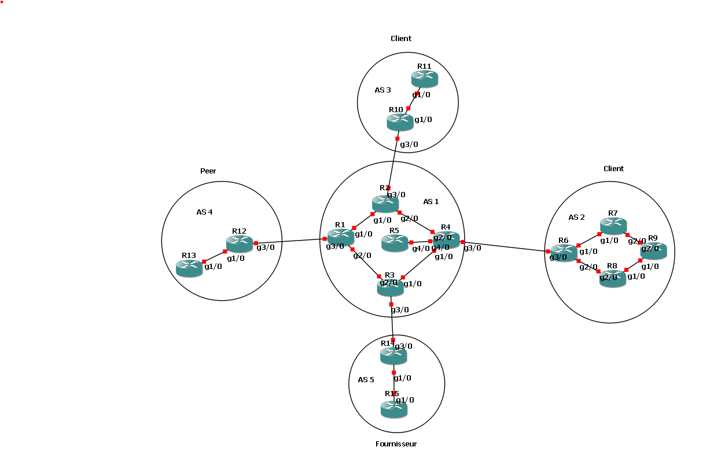

# GNS3 Configuration Generator

This project is designed to simplify the process of generating configuration files for routers in your GNS3 project. The generated configurations are then pushed to the routers using Telnet.

## Table of Contents

1. [Prerequisites](#prerequisites)
2. [Getting Started](#getting-started)
    - [Creating the Intent File](#creating-the-intent-file)
    - [Launching the Main Script](#launching-the-main-script)
3. [File Structure](#file-structure)
4. [Sample Intent File](#sample-intent-file)
5. [Our network and intent file](#our-network-and-intent-file)

## Prerequisites

Before using this tool, ensure that you have the following:

- GNS3 project with routers running.
- Intent file describing your network (JSON format).
- Python 3 with the gns3fy module

## Getting Started

### Creating the Intent File

To create the intent file, you can launch the user interface provided by `UI_intent.py` or manually create a JSON file in the `/data` directory [(here's a sample)](#creating-the-intent-file). The intent file must describe the network topology in your GNS3 project.

### Launching the Main Script

To launch the `main.py` script, follow these steps:

1. Ensure your GNS3 project is up with running routers.
2. Your intent file is located in the `/data` directory
2. Open a terminal.
3. Navigate to the `code` directory.
4. Run the following command:

    ```bash
    python3 main.py {path to your GNS3 project folder} {name of your intent file}
    ```

    Example:

    ```bash
    python3 main.py /path/to/your/GNS3/project data.json
    ```

## File Structure

- **code:** Contains Python scripts and config files.
    - `main.py`: Main script for generating and pushing configurations.
    - `UI_intent.py`: User interface for creating JSON intent files.

    - **config-files:** Folder where generated configuration files are stored.

- **data:**
    - `data.json`: Sample intent file.
    - `complet.json`: A representation of the calculated intent file for easier navigation.

- **image**
    - `Architecture.png`: A screenshot of our GNS3 network.

## Sample Intent File

Here is an example of a sample intent file that represents the network topology:

```json
{
    "AS" :{
        "AS1" : {
            "IGP" : "RIP",
            "plage_IP" : {
                "interfaces_physique": "2001::/64",
                "interfaces_loopback": "1001::/64"
            },

            "routeurs" : [
                "R1",
                "R2",
                // ... Additional routers
            ],
            "liens" :[ 
            [["R1","G1/0"],["R2","G1/0"]],
            // ... Additional  links between routers
            ],
            "voisins" : {
                "AS2" : "Client"
                //  ... Other Autonomous Systems
            }
        
        },
        // ... Additional AS


    },
    "liens_eGP" : [
        [["R1","G3/0","2003:1::1/64"],["R4","G3/0","2003:1::2/64"]],
        // ... Additional eBGP peering link
    ]
}
```

## Our network and intent file

Here's our network : 

You can find the topology in JSON format in `/data/data.json`.
